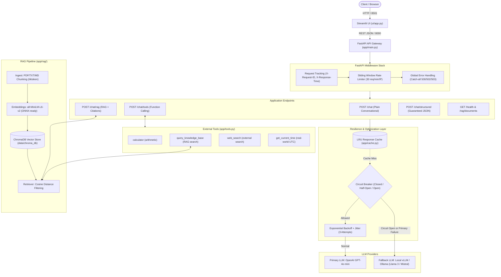

# Production-Ready AI Assistant & RAG System

[](https://fastapi.tiangolo.com)
[](https://streamlit.io)
[](https://www.trychroma.com/)
[](https://www.docker.com/)

A production-grade conversational AI assistant built with **FastAPI**, **Streamlit**, and **ChromaDB**. Features Retrieval-Augmented Generation (RAG), OpenAI function/tool calling, strict structured JSON outputs, and enterprise reliability patterns (retry with jitter, sliding-window rate limiting, circuit breaker failover, response caching, and asynchronous request processing).

---

## System Architecture



---

## Reliability & Production Engineering (Task 2)

| Pattern                          | Module                     | Details                                                                                          |
| -------------------------------- | -------------------------- | ------------------------------------------------------------------------------------------------ |
| **Exponential Backoff Retry**    | `app/llm_client.py`        | 3 attempts, randomized jitter (0.1s–0.4s) to prevent thundering herd, capped wait time.          |
| **Sliding-Window Rate Limiting** | `app/middleware.py`        | 30 requests/minute per client IP with `429 Too Many Requests` and `Retry-After` header.          |
| **Circuit Breaker**              | `app/circuit_breaker.py`   | Trips open after 5 consecutive failures, 30s recovery cooldown, probes with half-open test.      |
| **Automatic Fallback**           | `app/llm_client.py`        | Automatically routes to local vLLM or Ollama instance if primary cloud API fails.                |
| **Response Caching**             | `app/cache.py`             | Thread-safe LRU cache with TTL (256 entries, 5-minute expiry) hashing messages + parameters.     |
| **Async Execution**              | `app/main.py`              | Synchronous ChromaDB queries offloaded to thread pool (`asyncio.to_thread`) to prevent blocking. |
| **Telemetry & Observability**    | `app/middleware.py`        | Every response tagged with `X-Request-ID` and execution latency `X-Response-Time`.               |
| **Graceful Degradation**         | `app/main.py`, `ui/app.py` | Structured error models (`429`, `500`, `502`, `503`) with user-friendly alerts.                  |

---

## Quick Start Guide

### Prerequisites

- [Docker](https://docs.docker.com/get-docker/) & [Docker Compose](https://docs.docker.com/compose/)
- An OpenAI API Key (or local vLLM / Ollama instance)

### 1. Environment Configuration

Copy `.env.example` to `.env`:

```bash
cp .env.example .env
```

Set your OpenAI API Key in `.env`:

```ini
LLM_PROVIDER=openai
OPENAI_API_KEY=sk-your-key-here
OPENAI_MODEL=gpt-4o-mini
```

### 2. Launch Stack with Docker Compose

```bash
# Option A: Standard stack (FastAPI Backend + Streamlit UI)
docker compose up --build -d

# Option B: Full stack with local Ollama fallback
docker compose --profile ollama up --build -d

# Option C: Full stack with local vLLM serving Llama 3
docker compose --profile vllm up --build -d
```

### 3. Access Application Services

- **Web UI:** [http://localhost:8501](http://localhost:8501)
- **API Documentation (Swagger):** [http://localhost:8000/docs](http://localhost:8000/docs)
- **Health Check & Telemetry:** [http://localhost:8000/health](http://localhost:8000/health)

---

## Local Development (Without Docker)

```bash
# 1. Create and activate virtual environment
python3 -m venv myenv
source myenv/bin/activate

# 2. Install dependencies
pip install -r requirements.txt
pip install -r requirements-ui.txt

# 3. Start backend
uvicorn app.main:app --host 0.0.0.0 --port 8000 --reload

# 4. Start UI (separate shell)
BACKEND_URL=http://localhost:8000 streamlit run ui/app.py
```

---

## REST API Specification

### `POST /chat`

Plain conversational chat with tunable parameters.

```json
// Request Body
{
  "message": "Explain recursion in one paragraph",
  "temperature": 0.2,
  "top_p": 1.0,
  "max_tokens": 500
}
```

### `POST /chat/tools`

Function-calling endpoint capable of invoking `calculator`, `query_knowledge_base`, `web_search`, and `get_current_time`.

```json
// Request Body
{
  "message": "Calculate sqrt(144) * 5 and tell me what documents are in the knowledge base."
}
```

### `POST /chat/rag`

Retrieval-augmented generation. Queries ChromaDB, retrieves relevant chunks, formats context, and returns answer with source citations and confidence rating.

```json
// Response Body
{
  "answer": "A decorator in Python is a callable that takes another function as an argument...",
  "sources": [{ "document": "python.pdf", "chunk_id": "7b8f9e..." }],
  "confidence": 0.95
}
```

### `POST /chat/structured`

Produces strict JSON output guaranteed to follow the `AssistantAnswer` schema.

### `GET /health`

Returns operational health, circuit breaker state, cache statistics, and ingestion status.

### `GET /rag/documents`

Lists distinct indexed documents in ChromaDB with chunk counts.

---

## Model Optimization & ONNX (Task 2)

See [`ONNX.md`](ONNX.md) for full technical analysis:

- **Hosted Cloud LLMs**: Closed-source API models cannot be exported to ONNX because model weights and graph definitions are proprietary.
- **Local LLMs**: Serving engines like **vLLM** (PagedAttention) and **Ollama** (GGUF SIMD assembly kernels) drastically outperform ONNX Runtime for autoregressive token decoding.
- **RAG Embeddings (ONNX Applicable)**: The sentence-transformers embedding model (`all-MiniLM-L6-v2`) is an encoder model with a static graph. Exporting to ONNX delivers **2.5× to 3.0× CPU speedup**.
- Export utility script provided in `app/rag/onnx_export.py`.

---

## Cloud Deployment Guide

### 1. Azure Container Apps

```bash
az containerapp up \
  --name ai-assistant-backend \
  --resource-group rg-ai-systems \
  --image <acr_registry>.azurecr.io/ai-assistant-backend:latest \
  --target-port 8000 \
  --ingress external \
  --env-vars "OPENAI_API_KEY=<key>" "LLM_PROVIDER=openai"
```

### 2. AWS ECS Fargate

1. Push Docker image to Amazon ECR.
2. Create Task Definition specifying 1 vCPU and 2 GB RAM.
3. Configure Application Load Balancer (ALB) targeting container port 8000.
4. Set secrets (`OPENAI_API_KEY`) via AWS Secrets Manager.

### 3. Google Cloud Run

```bash
gcloud run deploy ai-assistant-backend \
  --image gcr.io/<project-id>/ai-assistant-backend:latest \
  --platform managed \
  --region us-central1 \
  --port 8000 \
  --set-env-vars "OPENAI_API_KEY=<key>,LLM_PROVIDER=openai" \
  --allow-unauthenticated
```

---

## Automated Testing Suite

Run the comprehensive unit and integration test suite:

```bash
PYTHONPATH=. ./myenv/bin/python -m unittest discover -s tests -p "test_*.py" -v
```
# AgentifyTheAssistant
